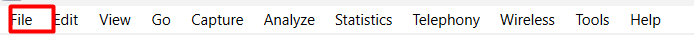
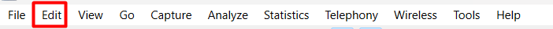
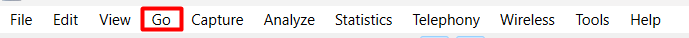
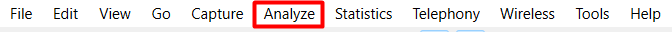
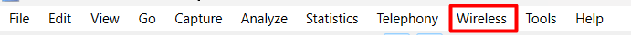
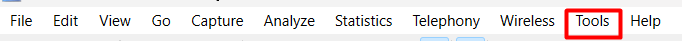
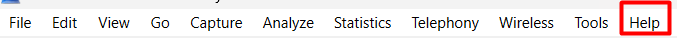
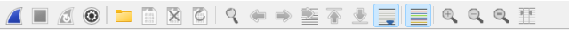
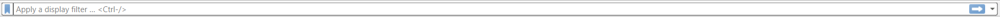

# Wireshark là gì?
 - Wireshark là ứng dụng phân tích mạng (network packet analyzer). Công dụng của ứng dụng này là dùng để bắt, phân tích và xác định các vấn đề có liên quan đến network bao gồm: kết nối chậm, rớt gói tin hoặc các truy cập bất thường. 
 - Thông qua Wireshark, quản trị viên có thể hiểu hơn về các Network Packets đang chạy trên hệ thống. Như vậy, việc xác định nguyên nhân gây ra lỗi cũng sẽ dễ dàng hơn.
# Wireshark dùng để làm gì?
- Wireshark được Network administrators sử dụng trong việc khắc phục sự cố về mạng.
- Wireshark còn được các kỹ sư Network security dùng để kiểm tra các vấn đề liên quan đến bảo mật.
- Wireshark lại được các kỹ sư QA sử dụng để xác minh các network applications.
- Wireshark được dùng trong việc gỡ lỗi triển khai giao thức.
- Đối với người dùng mạng máy tính bình thường thì Wireshark giúp chúng ta học internals giao thức mạng.
- Wireshark còn được sử dụng trong rất nhiều tình huống thực tế khác nữa mà chỉ những người trong giới chuyên môn mới biết câu trả lời.
# Tính năng nổi bật của Wireshark.
- Wireshark có sẵn cho hệ điều hành UNIX và Windows.
- Ứng dụng này giúp người dùng có thể chụp dữ liệu gói trực tiếp từ giao diện mạng.
- Thực hiện mở các tệp có chứa dữ liệu gói bằng tcpdump/ WinDump, Wireshark cũng như một số chương trình packet capture khác.
- Nhập các gói từ các tệp văn bản có chứa các hex dumps của packet data.
- Hiển thị các gói thông tin một cách vô cùng chi tiết.
- Tiến hành việc lưu trữ tất cả các dữ liệu gói đã bị bắt.
- Xuất một số hoặc tất cả các gói thông qua định dạng capture file.
- Dựa vào các tiêu chí khác nhau để lọc các gói tin.
- Dựa trên nhiều tiêu chí để tìm kiếm các gói.
- Colorize là gói hiển thị dựa trên bộ lọc.
- Wireshark còn giúp tạo các số liệu thống kê khác nhau.

- Menu này chứa các mục open và merge capture files, save, print, export capture files và quit.

- Menu này chứa các mục find a packet, time reference hoặc đánh dấu một hoặc nhiều gói tin, xử lý các cấu hình và đặt tùy chọn của bạn.

- Menu này chứa các mục để chuyển đến một gói cụ thể như: Back, Forward , Go to Packet

- Menu này cho phép bạn bắt đầu và dừng bắt gói tin và chỉnh sửa các bộ lọc.

- Menu này chứa các mục để thao tác các bộ lọc, bật hoặc tắt phân tích các giao thức, giải mã và theo dõi luồng.

- Menu này sẽ hiển thị các cửa sổ thống kê khác nhau bao gồm tóm tắt các gói đã được thu thập, hiển thị thống kê phân cấp giao thức và nhiều công dụng khác.

- Menu này chứa các mục để hiển thị các thống kê mạng liên quan đến điện thoại.

- Menu này chứa các mục để hiển thị thống kê không dây Bluetooth và IEEE 802.11

- Menu này chứa các công cụ khác nhau có sẵn trong Wireshark, chẳng hạn như tạo Quy tắc ACL tường lửa.

- Menu này chứa các mục để giúp người dùng, chẳng hạn như truy cập vào một số trợ giúp cơ bản, các trang hướng dẫn sử dụng các công cụ dòng lệnh khác nhau, truy cập trực tuyến vào một số trang web và hộp thoại giới thiệu thông thường. Thanh công cụ chính cho phép truy cập nhanh vào các mục thường dùng từ menu.

Thanh công cụ bộ lọc cho phép người dùng đặt bộ lọc hiển thị để lọc gói nào được hiển thị.

Ngăn danh sách gói hiển thị một bản tóm tắt của mỗi gói tin được thu thập. Bằng cách nhấp vào các gói trong ngăn này, bạn kiểm soát những gì được hiển thị trong hai ngăn còn lại.